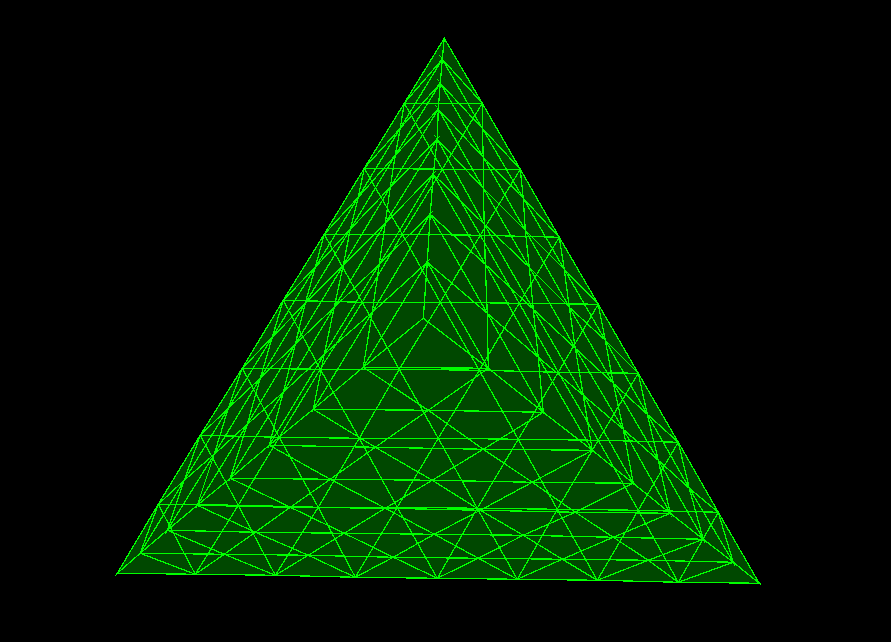

# 3D Renderer with Mouse Control (Java Swing)

This is a simple Java-based 3D renderer using `JPanel` and `Graphics2D` to simulate a 3D object (a tetrahedron) that you can rotate with your mouse.

## 🖱️ Features

- 3D rendering using basic perspective projection
- Mouse drag interaction for rotating the object (X and Y axis)
- Recursive triangle subdivision (inflation) for smoother surfaces
- Transparent polygon fill with wireframe outline
- Easy to extend with other shapes

## 📸 Preview




## 🧱 Built With

- Java Swing
- Custom 3D math (no external libraries)
- Simple OOP for shapes and geometry

## 💡 How It Works

1. A `RenderPanel` renders 3D triangles projected onto a 2D plane.
2. Mouse drag events control the rotation angles (`angleX`, `angleY`).
3. The `inflate` method subdivides each triangle into smaller ones to make the model smoother.
4. Basic perspective projection is done with a simple scaling formula based on Z-depth.

## 🧪 Run the Project

### Requirements

- JDK 8 or later
- Any IDE (e.g., IntelliJ, Eclipse) or terminal + javac

### Compile and Run

```bash
javac demo3d/Demo3DrenderWithMouse.java
java demo3d.Demo3DrenderWithMouse
```

## 🧩 Files Structure

```
demo3d/
├── Demo3DrenderWithMouse.java
├── Point3D.java (inner class)
├── Triangle.java (inner class)
├── preview.png (optional)
└── README.md
```

## 🚀 Possible Improvements

- Add zoom with mouse scroll
- Add more shapes (cube, sphere approximation)
- Add lighting and shading effects
- Export rendered image as PNG
- Use JOGL or LWJGL for real 3D acceleration

## 🎓 Educational Value

This project is ideal for:
- Beginners learning about 3D graphics
- Students wanting to understand rotation and projection
- Demos for computer graphics assignments

---

Made with 💻 by [Rushikesh Mithagare](https://www.linkedin.com/in/rushikesh-mithagare-639861178)
